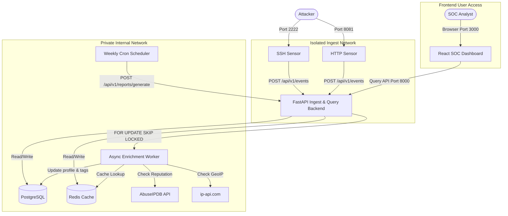

# Honeystack — Automated SOC Honeypot & Threat Intelligence Platform

Honeystack is a self-hosted, modular, and containerized threat intelligence platform. It runs active SSH and HTTP sensors (honeypots) inside isolated container environments, collects real attack metadata, enriches them with threat intelligence APIs, identifies coordinated campaigns, and displays the activity in a modern cybersecurity SOC (Security Operations Center) dashboard.

---

## System Architecture



---

## Core Capabilities & Hardening

* **Sensors**: 
  * **SSH Sensor**: Simulates a fake Ubuntu interactive shell, captures login credentials, client software versions, and logs all commands typed (with capabilities dropped via `cap_drop` to prevent container escapes).
  * **HTTP Sensor**: Serves realistic trap pages (`/.env`, `/wp-login.php`, phpMyAdmin) and matches attack payloads (SQLi, XSS, Cmd Injection, Traversal) using regex signatures.
* **Ingest Isolation**: Sensors communicate via a dedicated internal Docker network (`ingest-net`, marked `internal: true`) and cannot access internal databases or Redis directly.
* **Worker & Enrichment**: Async worker pools the database using thread-safe `FOR UPDATE SKIP LOCKED` querying to enrich IPs via `ip-api.com` and `AbuseIPDB`, classify credentials, detect campaigns (3+ IPs sharing UA/creds within 1 hour), and tag events with MITRE ATT&CK technique IDs.
* **PDF Reporting & Scheduling**: Automated report compilation running every Monday at 00:00 UTC with LLM summary generation (supporting OpenAI / Anthropic) and Jinja2 fallback, exporting reports directly as PDF binary files inside Postgres.

---

## Getting Started

### Prerequisites

* [Docker](https://www.docker.com/) and [Docker Compose](https://docs.docker.com/compose/)
* [Python 3.12](https://www.python.org/) (optional, only for running local tests and seeders)

### 1. Configuration Setup

Copy the example env file and update your configurations:
```bash
cp .env.example .env
```

*Inside `.env`:*
* Configure database credentials (`POSTGRES_USER`, `POSTGRES_PASSWORD`).
* Optionally add your `ABUSEIPDB_API_KEY`, `OPENAI_API_KEY`, or `ANTHROPIC_API_KEY` (if not supplied, the worker will gracefully fallback to standard geo-lookups and Jinja2 reporting).

### 2. Run the Platform

Start the entire modular stack using Docker Compose:
```bash
docker-compose up -d --build
```
This starts 8 services:
1. `honeystack-db` (PostgreSQL)
2. `honeystack-cache` (Redis)
3. `honeystack-api` (FastAPI backend)
4. `honeystack-worker` (threat intelligence worker)
5. `honeystack-scheduler` (report generator)
6. `honeystack-ssh-sensor` (SSH honeypot port 2222)
7. `honeystack-http-sensor` (HTTP web honeypot port 8081)
8. `honeystack-dashboard` (SOC front-end on port 3000)

### 3. Seed Sample Threat Data

To view the dashboard populated with data instantly (without waiting for real internet scans), run the seeding script:
```bash
# Activate virtual environment
source venv/bin/activate
# Run the seed exporter
PYTHONPATH=api python scripts/export_sample_data.py
```
This truncates all tables and injects 120 sample security events representing real-world SSH brute forces, crypto miner deployments, and web scans.

### 4. Open the Dashboards

* **SOC Dashboard UI**: [http://localhost:3000](http://localhost:3000)
* **FastAPI Endpoint Docs**: [http://localhost:8000/docs](http://localhost:8000/docs)

---

## Verifying Code Correctness & Tests

Unit tests are placed alongside their respective modules and run via `pytest`.

```bash
# Run API endpoint tests
PYTHONPATH=api ./venv/bin/pytest api/tests/

# Run HTTP sensor tests
PYTHONPATH=http-sensor ./venv/bin/pytest http-sensor/

# Run SSH sensor tests
PYTHONPATH=ssh-sensor ./venv/bin/pytest ssh-sensor/

# Run async worker tests
PYTHONPATH=worker ./venv/bin/pytest worker/
```

---

## Portfolio Success Metrics

* **Performance**: API ingest rate-limited at 1,000 requests/minute to withstand high-volume brute-force attacks.
* **Efficiency**: Redis caching layer with a 24-hour TTL prevents repeated AbuseIPDB API credit drainage.
* **Safety**: Async worker implements multi-replica safe queries using `FOR UPDATE SKIP LOCKED`, preventing database race conditions.
